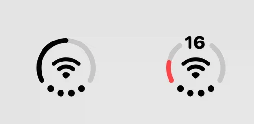
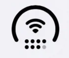

1. 위젯 개편
1. 위젯 및 앱을 옮길 때 옮기려는 앱과 위젯이 다른 앱과 위젯을 밀어내지 못 함. 화면에 공간이 있으면 옆으로 밀어내고, 없으면 옆 페이지로 밀어낼 것(페이지가 없으면 페이지 생성도 할 것).

1. 상태 아이콘 목록에서 현재 '링, 링, 잔량 표시 링, ...'이렇게 되어 있음. 두 번째 링을 `삼색 링`으로 변경
1. 상태 아이콘 개선판 추가: 현재 네트워크 아이콘이 원 안에 와이파이 아이콘과 함께 있는데 네트워크 점 표시는 배터리 원과 함께 되도록. 배터리 숫자 표시를 켤 때는 선과 선 사이에 공간을 두고 거기에 숫자가 들어가도록. 와이파이가 없을 때는 현재 네트워크(LTE/5G)를 표시. 싱글 심은 점 4개지만, 듀얼심은 두 줄로 구성. 또한 이 아이콘을 쓸 때는 날짜, 시간을 따로 커스터마이징 할 수 없도록 해당 옵션 두 개를 비활성화.
   
   

1. 앱 보관함에 아이폰처럼 작동하는 앱 숨김 폴더 만들 것.

1. 빌드 때 듀얼 앱 기능은 제거한 상태로 빌드

1. 노티바(알림바) 보이기/숨기기 토글 추가
